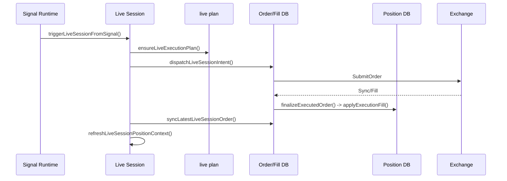
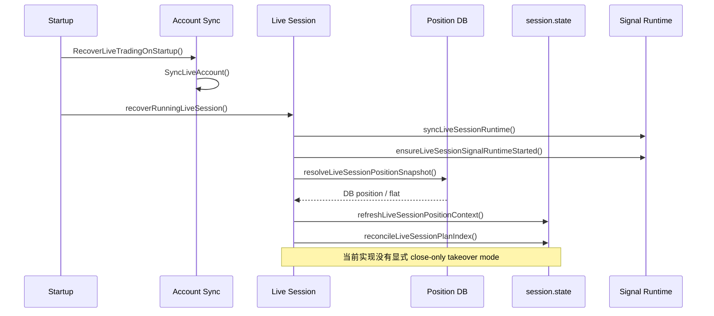
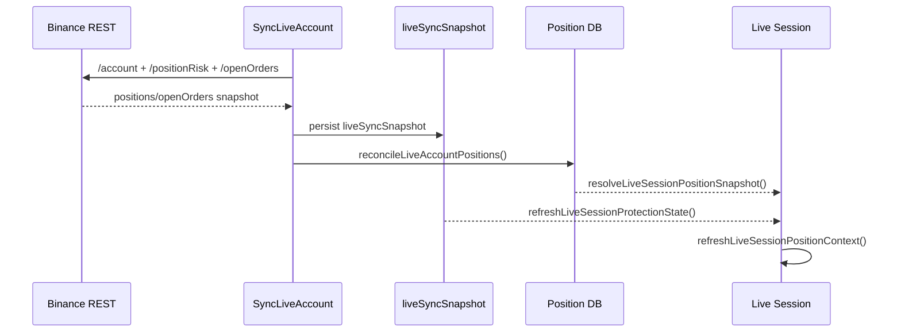

# Runtime Recovery Source-of-Truth Map

Issue: `#84 [runtime-recovery] 1. Build source-of-truth matrix and recovery sequence maps`

本文只梳理当前实现中的事实链，不修改交易逻辑。

引用约定：

1. 正文默认使用“文件路径 + 函数名”作为稳定引用。
2. 如无特别说明，源码定位以函数名为准，不以精确行号为准。
3. 后续若 `live.go` / `live_recovery.go` / `live_execution.go` 演进，优先校正文档中的函数引用关系，而不是维护正文里的行号快照。

## 1. Summary

当前实现里并不存在一个显式的 `takeover mode` 状态机。恢复链路实际上由四类事实源拼接而成：

1. `Position` 表 / `store.FindPosition()` 返回的 DB 持仓
2. `account.Metadata.liveSyncSnapshot` 中的交易所 REST 快照
3. `live session.state` 中的派生缓存
   - `recoveredPosition`
   - `livePositionState`
   - `virtualPosition`
   - `recoveredProtectionOrders`
4. 进程内 `p.livePlans[session.ID]` 计划缓存

从当前代码看，真实持仓事实优先级大致是：

1. 交易所 REST 同步写回后的 `Position` 表
2. 本地 DB `Position` 表
3. `livePositionState` 对真实仓位的补充字段
4. `virtualPosition` 仅作为无真实仓位时的虚拟上下文

订单活跃性事实优先级则是分裂的：

1. DB `Order.Status`
2. session `lastSyncedOrderStatus` / `lastDispatchedOrderStatus`
3. `liveSyncSnapshot.openOrders` 中的交易所快照订单

这意味着当前系统的“事实源”不是单点，而是按场景切换。

当前交付覆盖：

1. source-of-truth matrix
2. recovery sequence maps
3. function-level findings
4. P0/P1/P2 风险分类
5. recommended next code-fix order

## 2. Source-of-Truth Matrix

| 场景 | 持仓事实源 | 订单事实源 | 计划/运行时事实源 | 当前结论 |
| --- | --- | --- | --- | --- |
| 正常运行 | `resolvePaperSessionPositionSnapshot()` 读取 DB `Position`，见 `internal/service/paper.go` | `syncLatestLiveSessionOrder()` 读取 DB `Order` 并必要时再向适配器同步，见 `internal/service/live_execution.go` | `p.livePlans` + session `planIndex`，见 `internal/service/live.go` 中的 `ensureLiveExecutionPlan()` | DB 是运行态主事实源，session state 是缓存/派生层 |
| 启动恢复 | `RecoverLiveTradingOnStartup()` 先跑 `SyncLiveAccount()`，再对 RUNNING session 执行 `recoverRunningLiveSession()`，见 `internal/service/live.go` | 若有 `lastDispatchedOrderId`，恢复时调用 `syncLatestLiveSessionOrder()`，见 `internal/service/live.go` 与 `internal/service/live_execution.go` | `syncLiveSessionRuntime()` 重连 runtime，`ensureLiveExecutionPlan()` / `refreshLiveSessionPositionContext()` 重建状态 | 恢复依赖“先 account sync、再 session recovery”，但 sync 失败不会阻断后续 session 恢复 |
| DB-backed historical takeover | `resolveLiveSessionPositionSnapshot()` 先读 DB position，再合并 `livePositionState`，见 `internal/service/live.go` | session 最近订单状态 + DB orders | `reconcileLiveSessionPlanIndex()` 会直接按 DB/virtual 仓位修正 `planIndex`，见 `internal/service/live.go` | 当前没有显式“仅接管/仅平仓”模式，DB 仓位会直接进入普通运行链 |
| Exchange-backed takeover | `syncLiveAccountFromBinance()` 拉 REST 快照后调用 `reconcileLiveAccountPositions()` 写回 DB，见 `internal/service/live.go` | `liveSyncSnapshot.openOrders` 提供保护单/退出单恢复视角，见 `internal/service/live_recovery.go` 中的 `refreshLiveSessionProtectionState()` | session 后续仍走普通 `refreshLiveSessionPositionContext()` / `ensureLiveExecutionPlan()` | 交易所是“事实输入源”，但会先落到 DB，再由后续逻辑视作本地事实 |
| Reconcile path | `reconcileLiveAccountPositions()` 以交易所 open positions 覆盖本地 Position 表，未出现的 symbol 会被删除，见 `internal/service/live.go` | `reconcileLiveAccountExchangeOrder()` 以交易所订单同步 DB order，见 `internal/service/live.go` | 不直接修 session plan，仅通过后续 refresh/recovery 间接生效 | reconcile 是当前最接近 authoritative override 的路径 |

## 3. Function-Level Findings

### 3.1 任务要求的直接回答

| 问题 | 结论 | 函数 | 文件 | 观察 |
| --- | --- | --- | --- | --- |
| 哪个函数把 DB position 当事实源 | `resolvePaperSessionPositionSnapshot()` | `resolvePaperSessionPositionSnapshot()` | `internal/service/paper.go` | 直接调用 `p.store.FindPosition(accountID, symbol)`，`quantity <= 1e-9` 直接视作 flat |
| 哪个函数把 exchange snapshot 当事实源 | `syncLiveAccountFromBinance()` + `reconcileLiveAccountPositions()` | `syncLiveAccountFromBinance()` / `reconcileLiveAccountPositions()` | `internal/service/live.go` | REST 拉回的 `openPositions` 会覆盖本地 `Position` 表，未出现的 symbol 会删除 |
| 哪个函数把 session state 当 fact / cache / derived state | `resolveLiveSessionPositionSnapshot()`、`refreshLiveSessionPositionContext()` | `resolveLiveSessionPositionSnapshot()` / `refreshLiveSessionPositionContext()` | `internal/service/live.go` / `internal/service/live_recovery.go` | `livePositionState` 是真实仓位上的补充字段；`recoveredPosition` 是缓存镜像；`virtualPosition` 是 synthetic context |
| 哪个函数在重启后重建 plan/runtime state | `recoverRunningLiveSession()` | `recoverRunningLiveSession()`、`syncLiveSessionRuntime()`、`ensureLiveSessionSignalRuntimeStarted()`、`ensureLiveExecutionPlan()` | `internal/service/live.go` | 先恢复 runtime linkage，再在后续评估/恢复流程里重建 plan 与 position context |
| 哪个函数会把 recovered session 静默带回 normal running behavior | `recoverRunningLiveSession()` | `recoverRunningLiveSession()` | `internal/service/live.go` | 即使 account sync 失败，仍会启动 runtime、同步最近订单、刷新 position context，最后 `UpdateLiveSessionStatus(..., "RUNNING")` |

### 3.2 函数级 Mapping

### 3.2.1 持仓存在性判断

| 函数 | 文件 | 角色 | 事实源判定 |
| --- | --- | --- | --- |
| `resolvePaperSessionPositionSnapshot()` | `internal/service/paper.go` | 基础持仓读取函数 | 直接读 DB `Position`；`quantity <= 1e-9` 视为 flat |
| `resolveLiveSessionPositionSnapshot()` | `internal/service/live.go` | live 会话持仓快照统一入口 | 先读 DB position；若存在真实仓位则可被 `livePositionState` 补充；若无真实仓位则回退到 `virtualPosition` |
| `reconcileLiveAccountPositions()` | `internal/service/live.go` | 用交易所 open positions 覆盖本地持仓 | 交易所快照优先于旧 DB position |
| `refreshLiveSessionProtectionState()` | `internal/service/live_recovery.go` | 恢复保护单与基础仓位状态 | 持仓仍读 DB；保护单读 `liveSyncSnapshot.openOrders` |
| `refreshLiveSessionPositionContext()` | `internal/service/live_recovery.go` | 恢复/刷新持仓上下文 | 读取 `resolveLiveSessionPositionSnapshot()` 结果，再派生 `livePositionState` / watchdog 状态 |
| `finalizeExecutedOrder()` -> `applyExecutionFill()` | `internal/service/order.go` | 成交后更新 canonical DB 持仓 | fill 落账后直接更新或删除 `Position` 表，是正常运行态的仓位真相落点 |

### 3.2.2 订单是否仍活跃

| 函数 | 文件 | 角色 | 判定规则 |
| --- | --- | --- | --- |
| `isTerminalOrderStatus()` | `internal/service/live_execution.go` | 统一终态判断 | `FILLED/CANCELLED/REJECTED/virtual-initial/virtual-exit` 视为终态 |
| `HasActivePositionsOrOrders()` | `internal/service/safety_checks.go` | stop/delete/切换前的硬门禁 | order status 为 `NEW/PARTIALLY_FILLED/ACCEPTED` 视为活动订单 |
| `syncLatestLiveSessionOrder()` | `internal/service/live_execution.go` | session 最近订单状态同步 | 读 DB order，必要时调 adapter `SyncLiveOrder()` 或 `CancelLiveOrder()` 决定是否仍 working |
| `shouldAutoDispatchLiveIntent()` | `internal/service/live.go` | 自动派单门控 | 若 session 最近订单状态非终态，则禁止自动派单 |
| `activeLiveWatchdogExitOrder()` | `internal/service/live_recovery.go` | 恢复态避免重复退出单 | 读取 `recoveredProtectionOrders`，筛选非终态 reduce-only/closePosition 订单 |

### 3.2.3 恢复 / 接管 / 计划重建

| 函数 | 文件 | 角色 | 当前语义 |
| --- | --- | --- | --- |
| `RecoverLiveTradingOnStartup()` | `internal/service/live.go` | 启动恢复总入口 | 先 sync 所有 LIVE account，再恢复所有 RUNNING session |
| `SyncLiveAccount()` | `internal/service/live.go` | account 级同步入口 | 优先 adapter sync，失败后回退到 local state |
| `syncLiveAccountFromLocalState()` | `internal/service/live.go` | 本地 fallback 快照 | 只汇总本地 DB order/fill/position，不提供交易所纠偏 |
| `syncLiveAccountFromBinance()` | `internal/service/live.go` | Binance REST authoritative snapshot | 拉账户/持仓/挂单，写入 `liveSyncSnapshot`，并对本地持仓做 reconcile |
| `recoverRunningLiveSession()` | `internal/service/live.go` | RUNNING session 启动恢复 | 即使 `SyncLiveAccount()` 失败也继续恢复 runtime 和 position context |
| `syncLiveSessionRuntime()` | `internal/service/live.go` | 重连 signal runtime | 负责重建 runtime linkage，但不验证仓位真相 |
| `ensureLiveSessionSignalRuntimeStarted()` | `internal/service/live.go` | 恢复 runtime 可运行性 | 启动 runtime 并等待 ready |
| `ensureLiveExecutionPlan()` | `internal/service/live.go` | 构建或复用 live plan | 新 plan 构建后会立即按当前持仓/virtual 仓位修正 `planIndex` |
| `reconcileLiveSessionPlanIndex()` | `internal/service/live.go` | 按持仓状态回收 plan index | flat 时可回滚到 entry，持仓存在时可推进到 exit |
| `reconcileLivePlanIndexWithPosition()` | `internal/service/live.go` | 纯 plan index 规则 | 仅根据“有无仓位/virtual 仓位”修正索引，不验证来源可信度 |
| `finalizeLiveSessionPlanExhausted()` | `internal/service/live.go` | exhausted 后 rollover | 无真实/虚拟持仓且无活动订单时允许进入下一轮 plan |

### 3.3 测试锚点

以下测试已经为本报告中的关键观察提供了现成断言基础：

| 观察 | 代表测试 | 文件 |
| --- | --- | --- |
| `virtualPosition` 不应伪装成真实仓位 | `TestResolveLiveSessionPositionSnapshotUsesVirtualPosition` | `internal/service/live_test.go` |
| `zero quantity` DB position 应视为 flat | `TestResolveLiveSessionPositionSnapshotIgnoresZeroQuantityStoredPosition` | `internal/service/live_test.go` |
| cached plan index 会按仓位存在性回滚/推进 | `TestEnsureLiveExecutionPlanReconcilesCachedPlanIndexBackToEntryWhenPositionFlat` / `...ToExitWhenPositionExists` | `internal/service/live_test.go` |
| exhausted plan 在 flat session 上会 rollover | `TestEvaluateLiveSessionOnSignalRollsOverFlatSessionWhenPlanExhausted` | `internal/service/live_test.go` |
| recovery 会重建 `livePositionState` | `TestRefreshLiveSessionPositionContextRebuildsLivePositionState` | `internal/service/live_test.go` |
| recovery 会生成 watchdog fallback proposal | `TestRefreshLiveSessionPositionContextGeneratesLongWatchdogFallbackOnStopLossBreach` / `...Short...` | `internal/service/live_test.go` |
| 已有 reduce-only 退出单会抑制重复 watchdog proposal | `TestRefreshLiveSessionPositionContextDoesNotRetriggerWatchdogWhileExitOrderWorking` / `...TracksActiveReduceOnlyExitOrder` | `internal/service/live_test.go` |
| account sync 可以退回 local fallback snapshot | `TestSyncLiveAccountReturnsFallbackSnapshotWithoutReportingAdapterFailure` | `internal/service/live_test.go` |

## 4. Recovery Sequence Maps

### 4.1 正常运行: entry -> open -> close

### 4.2 DB historical position -> restart -> takeover -> close

### 4.3 Exchange sync -> reconcile -> takeover

## 5. 事实链说明

### 5.1 当前哪些东西是 fact，哪些是 cache

| 对象 | 类型 | 当前角色 |
| --- | --- | --- |
| `Position` 表 | fact | live 持仓的本地 canonical truth |
| `Order` / `Fill` 表 | fact | 活动订单与成交的本地 canonical truth |
| `liveSyncSnapshot.positions/openOrders` | external fact snapshot | 交易所同步时的 authoritative 输入，但同步后主要通过 DB 间接生效 |
| `recoveredPosition` | cache | 恢复链路写入 session 的快照镜像 |
| `livePositionState` | derived state | 止损/保护/水位等派生风控语义，不应单独充当真实仓位事实源 |
| `virtualPosition` | synthetic state | 无真实仓位时的虚拟上下文，用于 zero-initial/virtual path |
| `p.livePlans[session.ID]` | process cache | 当前进程内计划缓存，重启后丢失 |

### 5.2 当前恢复链的真实优先级

1. 如果 `SyncLiveAccount()` 成功且走 Binance REST，同步结果会先更新 `liveSyncSnapshot`，再用 `reconcileLiveAccountPositions()` 更新 DB `Position`。
2. 后续所有 session 恢复函数并不直接以交易所 payload 为真，而是继续通过 `resolveLiveSessionPositionSnapshot()` 读取 DB。
3. `livePositionState` 只在“已经确认存在真实仓位”时补充字段，不单独制造真实仓位。
4. 若真实仓位不存在，则 `virtualPosition` 可以提供 monitoring 语义，但 `found=false`。

## 6. P0/P1/P2 Findings

以下风险基于当前代码路径推导，针对的是“事实链歧义”本身。

### P0

1. 启动恢复不会因为 account REST sync 失败而停下。`recoverRunningLiveSession()` 在 `SyncLiveAccount()` 失败后仍继续 runtime 恢复和 position refresh，见 `internal/service/live.go` 中的 `recoverRunningLiveSession()`。
2. DB-backed takeover 没有显式 hard reconcile gate。`ensureLiveExecutionPlan()` 和 `reconcileLiveSessionPlanIndex()` 会直接按 DB/virtual 仓位修正 `planIndex`，但这一步不要求交易所真相已确认，见 `internal/service/live.go` 中的 `ensureLiveExecutionPlan()` 与 `reconcileLiveSessionPlanIndex()`。
3. 当前没有显式的 recovery-only / close-only 状态机。历史仓位接管后会回到普通 RUNNING session 链路，允许普通策略评估继续进行。

### P1

1. 订单活跃性来源分裂。`HasActivePositionsOrOrders()` 只看 DB order status；watchdog 退出单恢复则看 `liveSyncSnapshot.openOrders`；自动派单门控又看 session 最近订单状态，三者可能漂移。
2. `virtualPosition` 会参与 `resolveLiveSessionPositionSnapshot()` 和 `reconcileLivePlanIndexWithPosition()` 的索引修正，这对 plan 恢复是必要的，但也让“synthetic context”参与了执行态推进判断。
3. `refreshLiveSessionProtectionState()` 使用 DB 持仓 + snapshot open orders 的混合视角；如果两者不同步，`positionRecoveryStatus` 可能在 `unprotected-open-position` / `closing-pending` 间出现瞬时歧义。

### P2

1. 当前缺少单独文档明确区分 `fact`、`cache`、`derived state`，后续修复很容易继续把 session.state 当作事实源写回。
2. Issue 84 所需的 takeover action matrix 目前在代码里是隐式的，状态名存在，但“允许动作集合”没有成文约束。
3. 现有测试已经覆盖不少恢复细节，但仍是函数级断言为主，不是完整的 source-of-truth 文档引用点。

## 7. Recommended Next Code-Fix Order

Issue 84 完成后，后续修复可以直接围绕以下三个接口收敛：

1. 在 `RecoverLiveTradingOnStartup()` / `recoverRunningLiveSession()` 之间建立 hard reconcile gate，先解决“sync 失败仍继续恢复”的 P0。
2. 在 `resolveLiveSessionPositionSnapshot()` 之前定义 takeover mode / close-only 行为矩阵，避免 DB historical takeover 直接落回普通运行链。
3. 在 `reconcileLiveSessionPlanIndex()` / `ensureLiveExecutionPlan()` 之前增加 `position truth verified` 门禁，阻止未验证仓位推进 plan。
4. 收敛订单活跃性判断，把 DB order、session order status、`liveSyncSnapshot.openOrders` 统一到一条优先级链上。
5. 最后补恢复态回归测试矩阵，重点覆盖 DB-backed takeover、exchange-only takeover、mismatch、duplicate-exit prevention。
