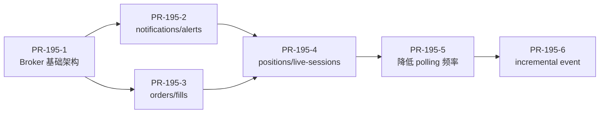

# Issue #195: Event-driven DashboardBroker 分阶段改造计划

## 背景

PR #187 引入了 Dashboard SSE 实时流式推送，当前 `DashboardBroker` 采用纯定时轮询（Polling + SHA256 Hash 比对）模式检测数据变更并推送 snapshot。本 Issue 的目标是将其改造为**事件驱动**模式，让业务写路径主动通知 Broker 数据已变更，从而减少无谓的 fetch/hash 开销，同时提升推送时效性。

### 当前架构概要

| 组件 | 文件 | 职责 |
|------|------|------|
| `DashboardBroker` | `internal/service/dashboard_broker.go` (216 行) | 管理 SSE 订阅者、轮询检测、hash 比对、snapshot 推送 |
| `Platform` | `internal/service/platform.go` | 持有 `dashboardBroker` 实例，提供 `StartDashboardBroker()` 和 `DashboardBroker()` 访问器 |
| SSE Handler | `internal/http/stream.go` (98 行) | HTTP 端点 `/api/v1/stream/dashboard`，Subscribe → PushInitialSnapshot → 事件循环 |
| 前端 Hook | `web/console/src/hooks/useDashboardStream.ts` (130 行) | EventSource 连接、重连、snapshot action 分发到 Zustand store |
| Config | `internal/config/config.go` | 7 个 `Dashboard*PollMs` 配置项，默认 2000ms，最小 1000ms |

### 7 个 Dashboard Domain

`live-sessions` · `positions` · `orders` · `fills` · `alerts` · `notifications` · `monitor-health`

---

## 全局设计约束

> [!CAUTION]
> 以下约束贯穿所有 6 个 PR，每个 PR 的执行者必须在提交前逐条自查。

### C1. Telemetry Only
Dashboard stream **只做遥测数据推送**。禁止通过该通道承载：start/stop live session、place/cancel order、approve trade、change dispatchMode、change runtime policy。

### C2. Snapshot Remains Authoritative
即使引入 event-driven，**不移除 snapshot 机制**。Snapshot 用于：初始化连接、断线恢复、修复增量丢失、简化前端一致性。

### C3. Broker Must Not Block Write Path
- `NotifyChanged` 必须**非阻塞**（`select + default` drop）。
- 内部 channel 必须有 buffer（建议 64-128）。
- channel 满时允许 drop 或标记 dirty，**绝不能阻塞业务写路径**。

### C4. Coalescing Is Required
高频写入时不能每次都立刻推 snapshot。对同一 domain 做短窗口合并（建议 200-500ms）：
```
order status changed x 20 within 300ms → coalesce into 1 orders snapshot publish
```

### C5. 不破坏 PR #187 协议
SSE 事件格式（`event: <type>\ndata: <json>\n\n`）、`DashboardEvent` 结构体（seq/type/action/payload/timestamp）、前端 `handleEvent` 逻辑均不能变。

### C6. HTTP Polling Fallback 始终保留
前端 `useDashboardStream` 中的 polling fallback 逻辑在任何阶段都不删除。

### C7. 不改交易执行路径
`internal/service/live*.go` 和 `internal/service/execution_strategy.go` 中的执行逻辑不因本改造而产生语义变化。调用 `NotifyChanged` 只是在已有写路径**末尾追加一行通知**，不改变原有控制流。

---

## PR-195-1: Broker 基础架构与合并机制

### 目标
在 `DashboardBroker` 中引入 `NotifyChanged` 入口和 coalescing event loop，但**不接入任何业务写路径**。Polling 仍然是唯一的触发源，改为通过 `NotifyChanged` 进入合并流程。

### 涉及文件

#### [MODIFY] [dashboard_broker.go](file:///Users/fujun/node/bktrader/internal/service/dashboard_broker.go)

**1. 新增类型和常量：**
```go
type DashboardDomain string

const (
    DashboardDomainLiveSessions   DashboardDomain = "live-sessions"
    DashboardDomainPositions      DashboardDomain = "positions"
    DashboardDomainOrders         DashboardDomain = "orders"
    DashboardDomainFills          DashboardDomain = "fills"
    DashboardDomainAlerts         DashboardDomain = "alerts"
    DashboardDomainNotifications  DashboardDomain = "notifications"
    DashboardDomainMonitorHealth  DashboardDomain = "monitor-health"
)

type dashboardChange struct {
    Domain DashboardDomain
    Reason string
}
```

**2. 扩展 `DashboardBroker` 结构体：**
- 新增字段 `notifyCh chan dashboardChange`（buffer = 128）
- 新增字段 `fetchFuncs map[DashboardDomain]func() (any, error)` 用于统一 domain → fetchData 映射
- 新增字段 `coalesceWindow time.Duration`（默认 300ms）

**3. 新增 `NotifyChanged(domain DashboardDomain, reason string)` 方法：**
- 非阻塞写入 `notifyCh`
- channel 满时直接 drop（`select { case notifyCh <- change: default: }`）
- 方法签名必须与 Issue 描述一致

**4. 新增 `StartEventLoop(ctx context.Context)` 方法：**
- 从 `notifyCh` 读取变更信号
- 用 `time.Timer`（初始 stopped）实现 coalescing：
  - 收到第一个信号 → 记录 pending domain → 启动 timer
  - timer 到期前收到更多信号 → 只追加 pending domain，不重置 timer
  - timer 到期 → 对每个 pending domain 调用 `checkAndPublish`，清空 pending
- pending 用 `map[DashboardDomain]struct{}` 管理

**5. 抽取 `publishSnapshotForDomain(domain DashboardDomain)` 方法：**
- 将现有 `checkAndPublish` 的 `fetchData func()` 参数改为从 `fetchFuncs` 查表
- `StartPolling` 和 `StartEventLoop` 共用同一套 snapshot 发布逻辑

**6. 重构 `StartPolling`：**
- Ticker 回调改为调用 `NotifyChanged(domain, "polling")`
- 不再直接调用 `checkAndPublish`

**7. 初始化 `fetchFuncs`：**
- 在 `NewDashboardBroker` 中注册全部 7 个 domain 的 fetch 函数（从现有 `StartPolling` 的 lambda 提取）

#### [MODIFY] [platform.go](file:///Users/fujun/node/bktrader/internal/service/platform.go)

**`StartDashboardBroker` 方法：**
- 在现有 `go p.dashboardBroker.StartPolling(ctx, cfg)` 之后增加 `go p.dashboardBroker.StartEventLoop(ctx)`

**新增 `NotifyDashboardChanged` 便捷方法：**
```go
func (p *Platform) NotifyDashboardChanged(domain DashboardDomain, reason string) {
    if p.dashboardBroker == nil {
        return
    }
    p.dashboardBroker.NotifyChanged(domain, reason)
}
```
- nil 保护是必须的，防止测试或初始化阶段 panic

#### [NEW] [dashboard_broker_test.go](file:///Users/fujun/node/bktrader/internal/service/dashboard_broker_test.go)

测试用例（至少）：
1. `TestNotifyChangedNonBlocking` — 填满 channel 后继续调用不 panic 不阻塞
2. `TestCoalescingSameDomaion` — 300ms 内发 100 次同 domain，只触发 1 次 checkAndPublish
3. `TestCoalescingMultipleDomains` — 300ms 内发不同 domain，timer 到期后每个 domain 各触发 1 次
4. `TestNoSubscriberSkipsFetch` — 无订阅者时 `checkAndPublish` 不执行 fetch
5. `TestPollingTriggersNotifyChanged` — 验证 ticker 走 NotifyChanged 路径

### 禁止事项
- ❌ 不接入任何业务写路径（notifications/alerts/orders/fills/positions/live-sessions）
- ❌ 不改前端
- ❌ 不引入 incremental action
- ❌ 不删除 polling

### 验收标准
- [ ] `go test ./...` 通过
- [ ] SSE 原有 snapshot 行为不变（前端无感知）
- [ ] broker event loop 启动后没有 subscriber 时不会造成额外阻塞
- [ ] `NotifyChanged` 是非阻塞的（有测试证明）
- [ ] coalescing 有单元测试

---

## PR-195-2: 接入低风险 domain — notifications / alerts

### 目标
验证 event-driven 触发路径，只接低风险展示数据。

### 涉及文件

#### [MODIFY] [notifications.go](file:///Users/fujun/node/bktrader/internal/service/notifications.go)

在以下方法的**成功返回前**追加通知：
- `AckNotification` (L71) 成功后：`p.NotifyDashboardChanged(DashboardDomainNotifications, "notification-acked")`
- `UnackNotification` (L75) 成功后：`p.NotifyDashboardChanged(DashboardDomainNotifications, "notification-unacked")`

#### [MODIFY] alerts 相关写入路径

> [!WARNING]
> `ListAlerts()` 是纯读取方法（从 runtime state 实时计算），不存在显式的 "alert created" 写入点。Alerts 是由 runtime state 变化（health 变化、sync stale 等）间接产生的。因此 alerts domain 的 event-driven 触发应挂在**运行时状态变更**的出口处。

需要在以下位置追加通知（仅举例关键点，执行者需通读上下文确认完整性）：

**`internal/service/live.go`:**
- `syncLiveSessionsForAccountSnapshot` 成功后（L1171 附近）：通知 `DashboardDomainAlerts`
- live session status 变更（如 RUNNING → STOPPED → ERROR）后

**`internal/service/signals.go` 或运行时状态更新处:**
- runtime session state/health 变更后

> [!IMPORTANT]
> 由于 alerts 是计算型数据（每次 ListAlerts 都重新计算），event-driven 触发的效果取决于"源头状态变更"的覆盖面。第一版**不需要覆盖所有触发点**，保留 polling fallback 兜底即可。优先覆盖最高频的 2-3 个变更点。

#### 通用安全封装

确认 `Platform.NotifyDashboardChanged` 已在 PR-195-1 中实现且有 nil 保护。

### 禁止事项
- ❌ 不接 orders / fills
- ❌ 不接 positions / live-sessions
- ❌ 不改前端 reducer
- ❌ 不实现 upsert/delete

### 验收标准
- [ ] ack notification 后，SSE 能较快推送 `notifications` snapshot
- [ ] HTTP polling fallback 仍然可用
- [ ] 写路径不会因为 SSE subscriber 慢而阻塞
- [ ] `go test ./...` 通过

---

## PR-195-3: 接入 orders / fills（仍推 snapshot）

### 目标
订单与成交变化后主动触发 Dashboard 更新，但仍然推 recent snapshot，不做增量 reducer。

### 涉及文件

#### [MODIFY] [order.go](file:///Users/fujun/node/bktrader/internal/service/order.go)

在以下写入路径的**成功返回前**追加通知：

| 方法 | 行号 | 通知 Domain |
|------|------|------------|
| `CreateOrder` | L149 | `DashboardDomainOrders` |
| `finalizeExecutedOrder` | L960 | `DashboardDomainOrders` + `DashboardDomainFills` |
| `applyLiveSyncResult` | L805 | `DashboardDomainOrders`（状态变更时） |
| `SyncLiveOrder` | L754 | `DashboardDomainOrders` |
| `CancelLiveOrder` | L770 | `DashboardDomainOrders` |
| `applyExecutionFill` | L1243 | `DashboardDomainFills` |

> [!IMPORTANT]
> **边界约束：** Broker 获取数据仍通过 `ListOrdersWithLimit(50, 0)` 和 `ListFillsWithLimit(50, 0)`，recent 50 限制不变。`NotifyChanged` 只是触发 broker 重新 fetch + hash + publish，不改变 payload 内容。

#### 安全规则

> [!CAUTION]
> - `NotifyChanged` 调用必须放在 store 持久化**成功之后**，不能放在 store 写入之前
> - 不修改 `CreateOrder`、`finalizeExecutedOrder` 等方法的返回值、错误处理、日志逻辑
> - 不修改任何交易执行路径的控制流（if/else/return）
> - 如果某个方法有多个 return 出口，只在**成功路径**上追加通知

### 禁止事项
- ❌ 不做 `action=upsert` / `action=delete`
- ❌ 不改变 orders/fills 的 recent 50 边界
- ❌ 不改交易执行逻辑

### 验收标准
- [ ] 新订单创建后，SSE 推送 `orders` snapshot
- [ ] 订单状态变化后，SSE 推送 `orders` snapshot
- [ ] 新成交落账后，SSE 推送 `fills` snapshot
- [ ] recent 50 限制仍然生效
- [ ] `go test ./...` 通过

---

## PR-195-4: 接入 positions / live-sessions

### 目标
接入更靠近实盘状态的数据域，仍保持 snapshot-only。

### 涉及文件

#### Positions 触发点

| 文件 | 方法 | 场景 |
|------|------|------|
| `order.go` | `finalizeExecutedOrder` | 成交后持仓变化 |
| `order.go` | `applyExecutionFill` | Fill 应用到持仓 |
| `live.go` | `reconcileLiveAccountPositions` (L2190) | 对账后持仓变化 |
| `live.go` | `adoptLivePositionFromExchangeTruth` (L2435) | 从交易所接管持仓 |

#### Live Sessions 触发点

| 文件 | 方法 | 场景 |
|------|------|------|
| `live.go` | `CreateLiveSession` (L1493) | 创建会话 |
| `live.go` | `StartLiveSession` (L1910) | 启动会话 |
| `live.go` | `StopLiveSessionWithForce` (L2668) | 停止会话 |
| `live.go` | `DeleteLiveSessionWithForce` (L140) | 删除会话 |
| `live.go` | `UpdateLiveSession` (L154) | 更新会话 |
| `live.go` | `syncLiveSessionsForAccountSnapshot` (L1171) | 账户同步后刷新会话 |
| `live_execution.go` | `SyncLiveSession` (L183) | 同步会话状态 |

> [!CAUTION]
> **高风险区域警告：** `live.go` 和 `live_execution.go` 属于 AGENTS.md §3 定义的高风险目录。修改时必须：
> 1. 只在方法末尾（成功路径）追加 `NotifyDashboardChanged` 一行
> 2. 不改变任何 if/else/return 控制流
> 3. 不修改 state 字段赋值逻辑
> 4. PR 描述中明确声明修改了哪些高风险文件

#### Payload 安全约束

> [!WARNING]
> - live sessions payload **必须**继续使用 `ListLiveSessionsSummary()`（不是 `ListLiveSessions()`）
> - Summary 方法会裁剪 `sourceStates`、`signalBarStates` 等重型字段
> - 禁止在 SSE payload 中暴露 `sourceStates` / `signalBarStates`

### 禁止事项
- ❌ 不允许把 `sourceStates` / `signalBarStates` 推回前端
- ❌ 不改 dispatchMode
- ❌ 不改实盘执行路径的语义
- ❌ 不引入 WebSocket

### 验收标准
- [ ] 持仓变化后，SSE 推送 `positions` snapshot
- [ ] live session 状态变化后，SSE 推送 `live-sessions` summary snapshot
- [ ] payload 中不包含 `sourceStates` / `signalBarStates`
- [ ] `go test ./...` 通过

---

## PR-195-5: 降低 Polling Fallback 频率

### 目标
在 event-driven 覆盖主要 domain 后，降低 broker 内部 polling fallback 频率，减少周期性 fetch/hash 成本。

### 涉及文件

#### [MODIFY] [config.go](file:///Users/fujun/node/bktrader/internal/config/config.go)

修改 7 个 `Dashboard*PollMs` 的默认值：

| 配置项 | 当前默认 | 新默认 | 最小值 |
|--------|---------|--------|--------|
| `DASHBOARD_LIVE_SESSIONS_POLL_MS` | 2000 | 15000 | 5000 |
| `DASHBOARD_POSITIONS_POLL_MS` | 2000 | 15000 | 5000 |
| `DASHBOARD_ORDERS_POLL_MS` | 2000 | 10000 | 5000 |
| `DASHBOARD_FILLS_POLL_MS` | 2000 | 10000 | 5000 |
| `DASHBOARD_ALERTS_POLL_MS` | 2000 | 30000 | 5000 |
| `DASHBOARD_NOTIFICATIONS_POLL_MS` | 2000 | 30000 | 5000 |
| `DASHBOARD_MONITOR_HEALTH_POLL_MS` | 2000 | 15000 | 5000 |

> [!IMPORTANT]
> 以上数值仅为建议，执行者可根据实际测试微调，但必须满足：
> - 保留配置项，不写死
> - 保留最小值兜底（`intFromEnvWithMin` 的第三个参数）
> - 数值必须大于 coalescing window（300ms），避免 timer 冲突

### 禁止事项
- ❌ 不删除 polling fallback
- ❌ 不默认关闭 fallback
- ❌ 不改前端 SSE 协议

### 验收标准
- [ ] event-driven 触发仍能及时推送
- [ ] fallback polling 仍能修复事件遗漏
- [ ] broker 周期性 fetch/hash 频率降低（可通过日志或指标验证）
- [ ] 配置项仍可通过环境变量覆盖默认值

---

## PR-195-6: 评估并引入 incremental event（可选，最后做）

### 目标
在 snapshot event-driven 跑稳后，评估是否引入增量事件。**只从低风险 domain 开始**。

### 涉及文件

#### 后端

**`dashboard_broker.go`:**
- `publish` 方法支持 `action` 为 `"upsert"` 或 `"delete"`（当前只有 `"snapshot"`）
- 新增 `publishIncremental(domain, action, payload)` 方法

**notifications 写入路径:**
- `AckNotification` → 发布 `{ type: "notifications", action: "upsert", payload: { id, status: "acked", ... } }`
- `UnackNotification` → 发布 `{ type: "notifications", action: "delete", payload: { id: "..." } }`

#### 前端

**`useDashboardStream.ts`:**
- `handleEvent` 中增加对 `action === "upsert"` 和 `action === "delete"` 的处理
- 未知 action 安全忽略（已有 `if (parsed.action === 'snapshot')` 兜底）

#### 前端 Reducer

需要在 Zustand store 中为 notifications 实现 incremental reducer：
- `upsert`: 按 id 查找并更新，不存在则追加
- `delete`: 按 id 移除

### 禁止事项
- ❌ 不先从 orders / positions / live-sessions 做 incremental
- ❌ 不删除 snapshot
- ❌ 不删除 initial snapshot
- ❌ 不删除 reconnect snapshot

### 验收标准
- [ ] incremental reducer 有单元测试
- [ ] snapshot 仍可修复前端状态（断线重连验证）
- [ ] 断线重连后仍发送 snapshot
- [ ] 出现未知 action 时前端安全忽略或 fallback

---

## 总体验收标准

- [ ] #195 被拆成 6 个小 PR 执行，而不是一次性完成
- [ ] 每个 PR 都能独立验证、独立回滚
- [ ] 不破坏 PR #187 的 SSE snapshot 协议
- [ ] HTTP polling fallback 始终保留
- [ ] SSE payload 仍使用 summary / limit 策略，不引入大对象回流
- [ ] 交易执行路径不通过 Dashboard stream
- [ ] `go test ./...` 通过
- [ ] broker 单元测试覆盖 coalescing、无 subscriber、channel full 行为

## 非目标

- 不在本改造中实现 WebSocket
- 不在本改造中承载交易执行命令
- 不在本改造中移除 polling fallback
- 不在第一版中实现完整 replay / Last-Event-ID

## PR 依赖关系



## 关联

- PR #187: Dashboard SSE snapshot stream
- #194: Dashboard SSE 稳定性与可维护性优化
- #191 / #192 / #193: 建议在本改造前完成
